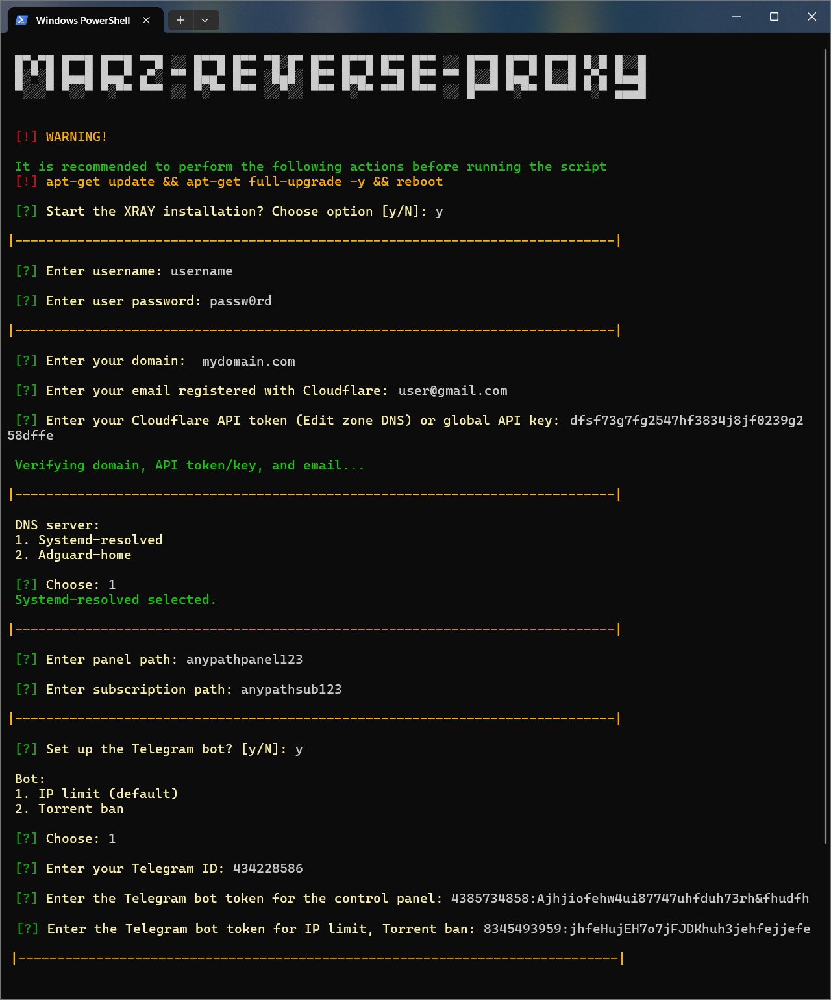

# REVERSE_PROXY ([Russian](/README_RU.md))
<p align="center"><a href="#"></a></p>

-----

### Server using NGINX reverse proxy
This script is designed for quick and easy setup of a reverse proxy server using NGINX. In this setup, all incoming requests are processed by NGINX, and the server functions as a reverse proxy server only if the request contains the correct path (URI). This enhances security and improves access control management.

> [!IMPORTANT]
>  This script has been tested on Debian 12 in a KVM virtualization environment. You will need your own domain, which needs to be bound to Cloudflare for it to work correctly. It is recommended to run the script as root on a freshly installed system.

> [!NOTE]
> The script is configured according to routing rules for users in Russia.

### Supported Operating Systems:

| **Ubuntu**       | **Debian**      |
|------------------|-----------------|
| 24.04 LTS        | 12 bookworm     |

-----

### Setting up cloudflare
1. Upgrade the system and reboot the server.
2. Configure Cloudflare:
   - Bind your domain to Cloudflare.
   - Add the following DNS records:

SERVER 1
| Type  | Name             | Content          | Proxy status  |
| ----- | ---------------- | ---------------- | ------------- |
| A     | example.com      | your_server_ip   | DNS only      |
| CNAME | www              | example.com      | DNS only      |

SERVER 2
| Type  | Name             | Content          | Proxy status  |
| ----- | ---------------- | ---------------- | ------------- |
| A     | nl.example.com   | your_server_ip   | DNS only      |
| CNAME | www.nl           | nl.example.com   | DNS only      |
   
3. SSL/TLS settings in Cloudflare:
   - Go to SSL/TLS > Overview and select Full for the Configure option.
   - Set the Minimum TLS Version to TLS 1.3.
   - Enable TLS 1.3 (true) under Edge Certificates.

-----

### Includes:
  
1. Proxy server configuration:
   - Support for automatic configuration updates through subscription and JSON subscription with the ability to convert to formats for popular applications.
   - The user “flow”: “xtls-rprx-vision” must be enabled
     - TCP-REALITY (Steal oneself) (disconnection will result in loss of access)
     - TCP-TLS
   - Important: it is recommended to choose one suitable connection type and use it for optimal performance. You can disable all incoming connections except the one marked as STEAL. Disabling STEAL will result in losing access to the web interface, as this connection type is used for proxy management access.
   - [Custom subcription](https://github.com/x0sina/marzban-sub).
   - [Torrent blocker](https://github.com/kutovoys/marzban-torrent-blocker).
   - [IP Limit](https://github.com/houshmand-2005/V2IpLimit).
2. Configuring NGINX reverse proxy on port 443.
3. Providing security:
   - Automatic system updates via unattended-upgrades.
   - Configuring Cloudflare SSL certificates with automatic updates to secure connections.
   - Configuring WARP to protect traffic.
   - Configuring UFW (Uncomplicated Firewall) for access control.
   - Configuring SSH, to provide the minimum required security.
   - Disabling IPv6 to prevent possible vulnerabilities.
   - Encrypting DNS queries using systemd-resolved (DoT) or AdGuard Home (Dot, DoH).
   - Selecting a random website template from an array.
4. Enabling BBR - improving the performance of TCP connections.

-----

### Installation of REVERSE_PROXY:

To begin configuring the server, simply run the following command in a terminal:
```sh
bash <(curl -Ls https://github.com/cortez24rus/marz-reverse-proxy/raw/refs/heads/main/reverse_proxy_server.sh)
```

### Selecting and installing a random template for the website:
```sh
bash <(curl -Ls https://raw.githubusercontent.com/cortez24rus/marz-reverse-proxy/refs/heads/main/reverse_proxy_random_site.sh)
```

The script will then prompt you for the necessary configuration information:

<p align="center"><a href="#"></a></p>

### Note: 
- Once the configuration is complete, the script will display all the necessary links and login information for the administration panel.
- All configurations can be modified as needed due to the flexibility of the settings.

-----

> [!IMPORTANT]
> This repository is intended solely for educational purposes and for studying the principles of reverse proxy servers and network security. The script demonstrates the setup of a proxy server using NGINX for reverse proxy, traffic management, and attack protection.
>
>We strongly remind you that using this tool to bypass network restrictions or censorship is illegal in certain countries that have laws regulating the use of technologies to circumvent internet restrictions.
>
>This project is not intended for use in ways that violate information protection laws or interfere with censorship mechanisms. We take no responsibility for any legal consequences arising from the use of this script.
>
>Use this tool/script only for demonstration purposes, as an example of reverse proxy operation and data protection. We strongly recommend removing the script after reviewing it. Further use is at your own risk.
>
>If you are unsure whether the use of this tool or its components violates the laws of your country, refrain from interacting with this tool.

-----

## Stargazers over time
[](https://starchart.cc/cortez24rus/marz-reverse-proxy)
