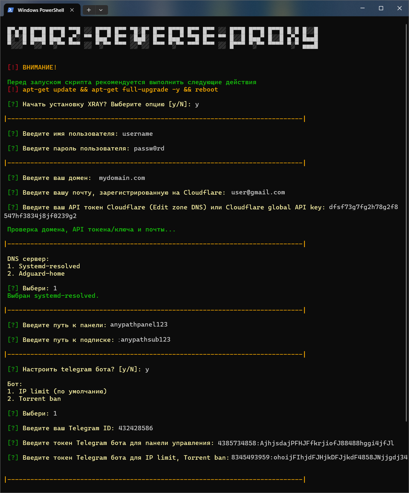

# REVERSE_PROXY ([English](/README.md))
<p align="center"><a href="#"></a></p>

-----

### Сервер с использованием реверс-прокси NGINX
Этот скрипт предназначен для быстрой и простой настройки обратного прокси-сервера с использованием NGINX. В данном варианте все входящие запросы обрабатываются NGINX, а сервер работает как обратный прокси-сервер только при условии, что запрос содержит правильный путь (URI). Это повышает безопасность и улучшает управление доступом.

> [!IMPORTANT]
> Этот скрипт был протестирован на Debian 12 в среде виртуализации KVM. Для корректной работы вам потребуется собственный домен, который необходимо привязать к Cloudflare. Скрипт рекомендуется запускать с правами root на свежеустановленной системе.

> [!NOTE]
> Скрипт настроен с учётом специфики маршрутизации для пользователей из России.

### Поддерживаемые операционные системы:

| **Ubuntu**       | **Debian**      |
|------------------|-----------------|
| 24.04 LTS        | 12 bookworm     |

-----

### Настройка cloudflare
1. Обновите систему и перезагрузите сервер.
2. Настройте Cloudflare:
   - Привяжите ваш домен к Cloudflare.
   - Добавьте следующие DNS записи:

Сервер #1
| Type  | Name             | Content          | Proxy status  |
| ----- | ---------------- | ---------------- | ------------- |
| A     | example.com      | your_server_ip   | DNS only      |
| CNAME | www              | example.com      | DNS only      |

Сервер #2
| Type  | Name             | Content          | Proxy status  |
| ----- | ---------------- | ---------------- | ------------- |
| A     | nl.example.com   | your_server_ip   | DNS only      |
| CNAME | www.nl           | nl.example.com   | DNS only      |

3. Настройки SSL/TLS в Cloudflare:
   - Перейдите в раздел SSL/TLS > Overview и выберите Full для параметра Configure.
   - Установите Minimum TLS Version на TLS 1.3.
   - Включите TLS 1.3 (true) в разделе Edge Certificates.

-----

### Включает в себя:
  
1. Конфигурация прокси сервера:
   - Поддержка автоматического обновления конфигураций через подписку и JSON подписку с возможностью конвертации в форматы для популярных приложений.
   - Необходимо включать у пользователя "flow": "xtls-rprx-vision"
     - TCP-REALITY (Steal oneself) (отключение приведет к потере доступа)
     - TCP-TLS
   - Важно: рекомендуется выбрать один подходящий тип подключения и использовать его для оптимальной работы. Вы можете отключить все входящие соединения, кроме того, которое отмечено как STEAL. Отключение STEAL приведет к потере доступа к веб-интерфейсу, так как этот тип соединения используется для доступа к управлению прокси.
   - Пользовательская подписка [(от legiz)](https://github.com/legiz-ru/marz-sub).
   - Node для реверс-прокси [(от blagodaren)](https://github.com/blagodaren/reverse-marz-node).
   - Блокировщик торрентов [(от kutovoys)](https://github.com/kutovoys/marzban-torrent-blocker).
   - Ограничение по IP [(от houshmand-2005)](https://github.com/houshmand-2005/V2IpLimit).
2. Настройку обратного прокси NGINX на порт 443.
3. Обеспечение безопасности:
   - Автоматические обновления системы через unattended-upgrades.
   - Настройка SSL сертификатов Cloudflare с автоматическим обновлением для защиты соединений.
   - Настройка WARP для защиты трафика.
   - Настройка UFW (Uncomplicated Firewall) для управления доступом.
   - Настройка SSH, для обеспечения минимально необходимой безопасности.
   - Отключение IPv6 для предотвращения возможных уязвимостей.
   - Шифрование DNS-запросов с использованием systemd-resolved (Dot) или AdGuard Home (Dot, DoH).
   - Выбор случайного шаблона веб-сайта из массива.
4. Включение BBR — улучшение производительности TCP-соединений.

-----

### Установка REVERSE_PROXY:

Для начала настройки сервера выполните следующую команду в терминале:
```sh
bash <(curl -Ls https://github.com/cortez24rus/marz-reverse-proxy/raw/refs/heads/main/reverse_proxy_server.sh)
```


### Выбор и установка случайного шаблона для веб-сайта:
```sh
bash <(curl -Ls https://github.com/cortez24rus/marz-reverse-proxy/raw/refs/heads/main/reverse_proxy_random_site.sh)
```

Скрипт запросит у вас необходимую конфигурационную информацию:

<p align="center"><a href="#"></a></p>

### Примечание: 
- После завершения настройки скрипт отобразит все необходимые ссылки и данные для входа в административную панель.
- Все конфигурации можно будет изменять по мере необходимости, благодаря гибкости настроек.

-----

> [!IMPORTANT]
> Этот репозиторий предназначен исключительно для образовательных целей и для изучения принципов работы обратных прокси-серверов и сетевой безопасности. Скрипт демонстрирует настройку прокси-сервера с использованием NGINX для реверс-прокси, управления трафиком и защиты от атак.
>
> Мы настоятельно напоминаем, что использование этого инструмента с целью обхода сетевых блокировок или цензуры является незаконным в ряде стран, где существуют законы, регулирующие использование технологий для обхода ограничений в интернете.
>
> Данный проект не предназначен для использования в целях, нарушающих законы о защите информации или вмешивающихся в механизмы цензуры. Мы не несем ответственности за возможные юридические последствия, связанные с использованием этого скрипта.
>
>Используйте этот инструмент/скрипт исключительно в демонстрационных целях, в качестве примера работы обратного прокси и защиты данных. Настоятельно рекомендуем удалить скрипт после ознакомления. Дальнейшее использование на ваш страх и риск.
>
>Если вы не уверены, нарушает ли использование данного инструмента или его компонентов законодательство вашей страны- откажитесь от любого взаимодействия с данным инструментом.

-----

## Количество звезд по времени
[](https://starchart.cc/cortez24rus/marz-reverse-proxy)
